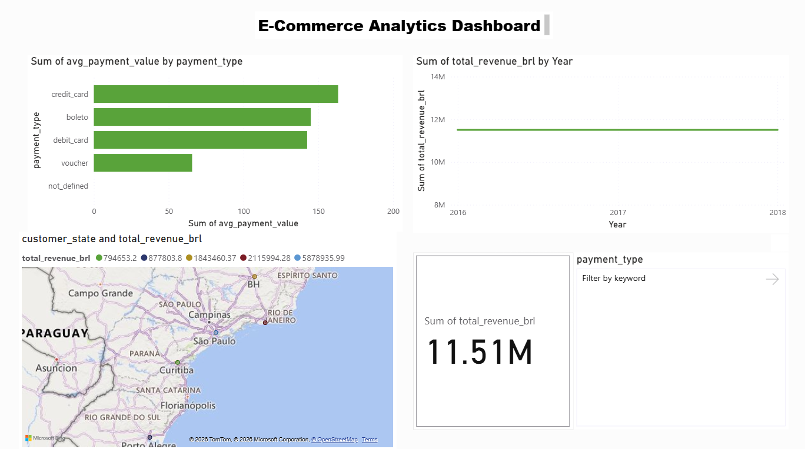

# Brazilian E-Commerce Analytics Project (Olist Dataset)

End-to-end data analytics showcase using SQL, Python, AWS (S3 + Athena), and Power BI.

## Business Questions Answered
- What are the top payment methods by count and revenue?
- Which Brazilian states generate the most orders and revenue?
- What are the top-selling product categories and cities?
- Monthly revenue trends over time

## Tech Stack
- **Database**: PostgreSQL (local)
- **Scripting**: Python (pandas, sqlalchemy, boto3)
- **Cloud**: AWS S3 (storage) + Athena (serverless SQL queries)
- **Visualization**: Power BI Desktop

## Project Workflow
1. Downloaded Olist Brazilian E-Commerce dataset from Kaggle
2. Loaded 9 CSVs into local PostgreSQL using Python
3. Wrote analysis SQL queries (joins, aggregations, GROUP BY)
4. Exported key results as CSV summaries
5. Uploaded raw + summary data to AWS S3
6. Created external tables in Athena and re-ran queries serverlessly
7. Built interactive dashboard in Power BI (connected to Athena + imported CSVs)

## Key Findings
- **Payments**: Credit card dominates (76,795 payments, 12.5M BRL – ~77% of revenue). Boleto is second.
- **Geography**: São Paulo leads by far (41,126 orders, 5.88M BRL). Southeast region (SP+RJ+MG) = majority of business.
- **Revenue Trend**: Rapid growth from 2017, peaked late 2017 to mid-2018 (~1.1M BRL/month).

### Top Payment Methods
| Payment Type  | Count   | Total Revenue (BRL) |
|---------------|---------|----------------------|
| credit_card   | 76,795  | 12,542,084.19       |
| boleto        | 19,784  | 2,869,361.27        |
| voucher       | 5,775   | 379,436.87          |

### Top States by Orders & Revenue
| State | Orders  | Revenue (BRL)     |
|-------|---------|-------------------|
| SP    | 41,126  | 5,878,939.99     |
| RJ    | 12,698  | 2,115,994.28     |
| MG    | 11,496  | 1,843,460.37     |

## Dashboard Preview

  

Interactive dashboard showing payment methods, top states by orders/revenue, monthly revenue trend, and key metrics.

## Files in this Repo
- `load_to_postgres.py` → Loads CSVs into PostgreSQL
- `upload_to_s3.py` → Uploads files to AWS S3
- `analysis_queries.sql` → All main SQL queries (PostgreSQL & Athena)
- `ecommerce-dashboard.pbix` → Power BI file
- `summaries/` → Exported result CSVs
- `dashboard-screenshot.png` → Dashboard image for README

## How to Run / Reproduce
1. Install PostgreSQL + pgAdmin
2. Download Olist dataset from Kaggle
3. Run `load_to_postgres.py` (edit password & path)
4. Run analysis queries in pgAdmin
5. Upload to S3 with `upload_to_s3.py` (edit credentials & bucket)
6. Create Athena tables and query
7. Open `ecommerce-dashboard.pbix` in Power BI

## Contact
Abdul  Rahaman G
Email: rahamanrahi13@gmail.com

⭐ If you find this helpful, give it a star!

